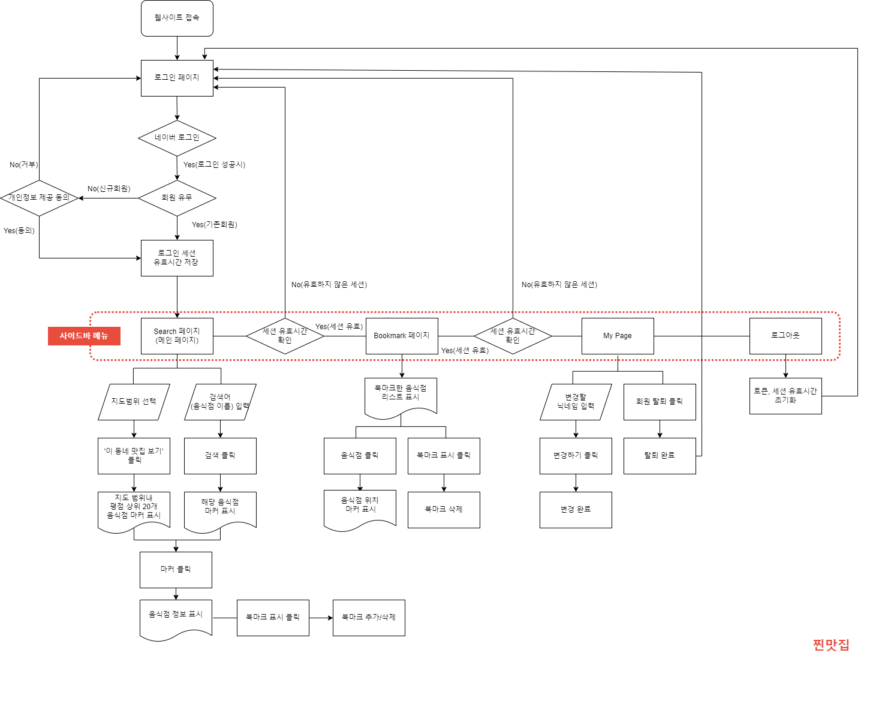

# 🍴 찐맛집

**찐맛집**은 서대문구 음식점의 네이버 지도, 카카오맵, 구글 지도 평점을 한눈에 볼 수 있는 웹 사이트입니다.

### 🌐 외부 링크

[웹 사이트](https://jjuniv.site), [노션](https://animated-index-cb7.notion.site/b5732366cf934f83b4d9e11024ab3cd9), [시연영상](https://youtu.be/pIJAG51Do8Q)

## 💻 프로젝트 소개

### 목차 

💡 [주요 기능](#💡-주요-기능)

👥 [팀원 정보](#👥-팀원-정보)

🛠️ [사용 기술 스택](#🛠️-사용-기술-스택)

📊 [ERD](#📊-erd)

✨ [프로젝트 구조](#✨-프로젝트-구조) 

📌 [Git 컨벤션](#📌-git-컨벤션)

***

### 💡 주요 기능

#### 1. 기능

(1) 회원관련

- 소셜 로그인(네이버 API)
- 회원정보(닉네임) 수정
- 회원탈퇴 <br><br>

(2) 음식점 관련

- 음식점 평점 조회
  - 검색 방법 : 지도 범위 선택 / 음식점 이름 검색
- 음식점 북마크 추가 / 삭제
- 북마크한 음식점 모아보기 (Archive)


#### 2. 화면흐름도

   


### 👥 팀원 정보 

#### 👩🏻‍💻임윤정

  `Back-end`
  - Selenium 라이브러리 활용 음식점 평점 크롤링 및 데이터 가공
  - Feign Client 기반 소셜 로그인 기능 및 JWT 토큰 인증 구현
  - JPA 기반 CRUD 구현
    - 회원 관련 : 회원가입, 회원정보(닉네임)수정, 회원탈퇴
    - 음식점 관련 : 특정 범위 안 음식점 리스트 조회, 음식점 이름 검색
    - 북마크 관련 : 회원별 북마크 리스트 조회, 북마크 추가 및 삭제
  - Restful API, CORS 설정
  
  `Front-end`
  - 라우터 설정
  - 소셜 로그인 기능 및 로그인 세션 유지 구현
  - 각 페이지 별 axios 비동기 통신 구현 
  - MyPage, Bookmark 페이지, 사이드바 CSS 

  `배포`
  - Dockerfile 및 Docker-Compose file 작성
  - 프로젝트 배포 코드 작성
  - README.md 작성

#### 👨🏻‍💻전지훈

  `Back-end`
  - Selenium 라이브러리 활용 음식점 평점 크롤링 및 데이터 가공
  
   `Front-end`
  - 로그인 페이지 CSS
  - Search 페이지 : 카카오맵 API 설정, 검색 기능 구현
  
  `Google Cloud Platform 배포`
  - VM 인스턴스 생성 및 환경 설정 (서버, 클라이언트)
  - Cloud MySQL DB 구축
  - SSL 프로토콜 적용

### 🛠️ 사용 기술 스택 

<p align="center">
<div> 
   
   
  
</div><div>
  
</div><div>
   
   
</div>
</p>

### 📊 ERD 


### ✨ 프로젝트 구조 

```
    │.gitignore
    │README.md
    │flowchart.png
    │
    ├─matjib-back
    │  ├─build
    │  │  └─libs
    │  │          Dockerfile
    │  │
    │  └─src
    │      └─main
    │          └─java
    │              └─matjibback
    │                  │  MatjibBackApplication.java
    │                  │
    │                  ├─controller
    │                  │      BookmarkController.java
    │                  │      CorsConfig.java
    │                  │      MemberController.java
    │                  │      RestaurantController.java
    │                  │
    │                  ├─entity
    │                  │      Bookmark.java
    │                  │      Member.java
    │                  │      Restaurant.java
    │                  │      State.java
    │                  │
    │                  ├─naverLogin
    │                  │      NaverLoginClient.java
    │                  │      NaverLoginConfig.java
    │                  │      NaverLoginResponse.java
    │                  │      NaverLoginService.java
    │                  │      NaverProfileClient.java
    │                  │      NaverProfileResponse.java
    │                  │      NaverUserInfo.java
    │                  │
    │                  ├─repository
    │                  │      BookmarkRepository.java
    │                  │      MemberRepository.java
    │                  │      RestaurantRepository.java
    │                  │
    │                  └─service
    │                          JwtService.java
    │                          JwtServiceImpl.java
    │                          MemberService.java
    │                          MemberServiceImpl.java
    │
    └─matjib-front
        │  .gitignore
        │  babel.config.js
        │  jsconfig.json
        │  package-lock.json
        │  package.json
        │  vue.config.js
        │
        ├─public
        │      favicon.png
        │      index.html
        │
        └─src
            │  App.vue
            │  main.js
            │
            ├─assets
            │      bg.jpg
            │
            ├─components
            │      Bookmark.vue
            │      Map.vue
            │      Sidebar.vue
            │
            ├─pages
            │      Archive.vue
            │      callback.vue
            │      Login.vue
            │      MyPage.vue
            │      Search.vue
            │
            ├─router
            │      index.js
            │
            └─store
                    store.js
```

### 📌 Git 컨벤션 

- 커밋
```
FEAT:    새로운 기능을 추가한 경우
FIX:     버그를 고친 경우
STYLE:   코드 포맷 변경, 간단한 수정, 코드 변경이 없는 경우
REFATOR: 코드 리팩토링
DOCS:    문서를 수정한 경우(ex> Swagger)
Rename:  파일 혹은 폴더명 수정 및 이동
Remove:  파일 삭제
CHORE:    빌드 업무 수정(ex> dependency 추가)
```

- 브랜치

```
사용 브랜치
feature - 기능
develop - 개발
master - 배포
hotfix - 급한 에러 수정

-브랜치 명명 규칙
feat / (front or back) / 기능이름
기능 완성 후 같이 테스트 해본 다음 main 브랜치에 merge
```
